# TrendGate: AI-Powered Social Media Trend Prediction Platform

## 📋 Table of Contents

1. [Project Overview](#project-overview)
2. [Problem Statement & Solution](#problem-statement--solution)
3. [Core Features](#core-features)
4. [System Architecture](#system-architecture)
5. [Data Flow](#data-flow)
6 [Technical Stack](#technical-stack)
7. [AI & Machine Learning Techniques](#ai--machine-learning-techniques)
8. [Project Structure](#project-structure)
9. [Setup Instructions](#setup-instructions)
10. [API Documentation](#api-documentation)
11. [Frontend Features](#frontend-features)
12. [Data Generation](#data-generation)
13. [Additional Details](#additional-details)

---

## 🎯 Project Overview

**TrendGate** is an advanced AI-powered platform designed to help marketers, content creators, and businesses predict social media trend lifecycles and detect early decline signals **before they happen**. By combining cutting-edge AI (Google Gemini 2.5 Flash), probabilistic modeling (Hidden Markov Models), real-time data sources (Google Trends, Reddit), and explainable AI techniques, TrendGate provides actionable insights to maximize campaign success and minimize wasted effort on dying trends.

### Key Capabilities

- **🔮 Predictive Campaign Analysis**: Analyze campaigns before launch and get viability scores (0-100)
- **📊 Real-Time Trend Health Monitoring**: Check if existing trends/hashtags are growing, peaking, or declining
- **⚠️ Decline Detection**: Identify the exact moment when a trend enters saturation or decline phase
- **💡 Explainable AI**: Get human-readable explanations for all predictions backed by web search
- **🧠 Multi-Source Intelligence**: Combine Gemini AI + HMM + Google Trends + Reddit for comprehensive analysis
- **📈 Data-Driven Recommendations**: Receive actionable strategies to extend trend lifecycles

---

## 🚀 Problem Statement & Solution

### The Problem

Social media marketers face a critical challenge:

1. **Trends die quickly**: What's viral today can be dead tomorrow
2. **Wasted resources**: Launching campaigns on declining trends wastes time and money
3. **Late detection**: By the time decline is visible, it's too late to pivot
4. **Lack of predictability**: No clear signals for when/why trends will decline
5. **Information overload**: Too many data sources, no unified insights

### Our Solution

TrendGate provides a **multi-layered predictive system**:

#### Layer 1: Hidden Markov Model (HMM) Analysis
- **5-state lifecycle model**: Emerging → Growth → Peak → Saturation → Decline
- **Probabilistic inference**: Viterbi algorithm decodes trend states from metrics
- **Pattern recognition**: Identifies 8 trend archetypes (viral crash, slow burn, controversy spike, etc.)

#### Layer 2: AI-Powered Grounded Search
- **Google Gemini 2.5 Flash** with Google Search grounding
- **Real-time web data**: Analyzes current market status, competition, and sentiment
- **Structured predictions**: Returns JSON with viability scores, risk factors, and recommendations

#### Layer 3: Additional Market Intelligence
- **Google Trends**: Search interest trends, slope analysis, decline risk scoring
- **Reddit Scraping**: Community engagement metrics, sentiment shifts, post velocity
- **No API keys needed**: Hackathon-safe implementation using pytrends + BeautifulSoup

#### Layer 4: Explainable AI
- **LangChain-powered investigation**: Investigates decline causes using web search
- **Confidence scoring**: Quantifies certainty of predictions
- **Human-readable reports**: Natural language explanations with actionable insights

### What Makes TrendGate Unique

| Feature | TrendGate | Traditional Analytics |
|---------|-----------|----------------------|
| **Predictive** | ✅ Predicts decline before it happens | ❌ Reactive to past data |
| **Multi-source** | ✅ Combines 4+ data sources | Limited to 1-2 platforms |
| **Explainable** | ✅ AI explains reasoning | ❌ Black-box scores |
| **Actionable** | ✅ Provides mitigation strategies | ❌ Only observes trends |
| **Real-time** | ✅ Live web search + trends data | Delayed analytics dashboards |

---

## ✨ Core Features

### 1. **Campaign Viability Analysis**
- Analyze campaigns **before** launch
- Get viability score (0-100) based on market saturation, timing, audience fatigue
- Predict trend lifecycle duration
- Identify competitive landscape and key players
- Receive platform-specific optimization strategies

### 2. **Trend Health Check**
- Quick health status for existing trends/hashtags
- Current state assessment (growing/peaking/declining/dead)
- Real-time engagement metrics
- Sentiment analysis (positive/negative/mixed)
- Recommendation: Continue/Reduce/Exit/Monitor

### 3. **Hashtag Comparison**
- Compare multiple hashtags side-by-side
- Popularity scores and competition levels
- Trend direction (up/stable/down) with Google Trends data
- Best combination recommendations
- Hashtags to avoid

### 4. **HMM-Based Decline Detection**
- Analyze historical trend data from synthetic dataset
- 5-state lifecycle visualization
- Pinpoint exact decline date and state
- Metrics breakdown (velocity, fatigue, retention)
- AI-generated investigation report

### 5. **Google Trends Integration**
- Search interest trends (3-month window)
- Slope analysis (rising/stable/declining)
- Current vs peak value comparison
- Risk scoring (0-100 decline probability)
- Early warning signals

### 6. **Reddit Community Analysis**
- Scrapes posts from relevant subreddits (no API needed)
- Engagement metrics (avg upvotes + comments)
- Engagement velocity (rate of change)
- Post frequency trends
- Sentiment shift detection

### 7. **Explainable AI Reports**
- Natural language explanations
- Confidence scores
- Decline signal detection
- Web-grounded insights
- Actionable recommendations

---

## 🏗️ System Architecture

```mermaid
graph TB
    subgraph Frontend["🌐 React Frontend (Vite)"]
        UI[User Interface]
        PostUpload[Post Upload Component]
        Charts[Recharts Visualizations]
    end

    subgraph Backend["🔧 FastAPI Backend"]
        API[REST API Server]
        Gemini[Gemini Advisor]
        HMM[HMM Analyzer]
    end

    subgraph AI_Services["🤖 AI Services"]
        GeminiAPI[Google Gemini 2.5 Flash]
        GoogleSearch[Google Search Grounding]
        LangChain[LangChain Agent]
        Serper[Serper Web Search]
    end

    subgraph DataSources["📊 Data Sources"]
        GTrends[Google Trends]
        Reddit[Reddit Scraper]
        SyntheticData[Synthetic Dataset]
    end

    subgraph ML_Engine["🧠 ML Engine"]
        HMM_Model[5-State HMM]
        Viterbi[Viterbi Decoder]
        DataGen[Data Generator v2]
    end

    UI --> API
    PostUpload --> API
    API --> Gemini
    API --> HMM

    Gemini --> GeminiAPI
    Gemini --> GTrends
    Gemini --> Reddit
    GeminiAPI --> GoogleSearch

    HMM --> HMM_Model
    HMM --> Viterbi
    HMM --> SyntheticData
    HMM --> LangChain
    LangChain --> Serper

    DataGen --> SyntheticData

    Charts -.->|Visualizes| HMM_Model
```



### Architecture Layers

#### 1. **Presentation Layer** (Frontend)
- **React 19.2.0** with hooks for state management
- **Vite** for fast development and HMR
- **TailwindCSS 4** for responsive, dark-themed UI
- **Recharts** for interactive data visualizations
- **Axios** for API communication
- **Lucide React** for icons

#### 2. **API Layer** (Backend)
- **FastAPI** for RESTful API endpoints
- CORS middleware for frontend integration
- Lazy loading for AI services (performance optimization)
- Error handling and graceful degradation
- JSON response formatting

#### 3. **AI Service Layer**
- **Google Gemini 2.5 Flash**: Campaign analysis with Google Search grounding
- **LangChain**: Trend investigation with web search
- **Groq/Featherless**: Fallback LLM services
- **Serper**: Web search API for LangChain

#### 4. **Data Intelligence Layer**
- **Google Trends (pytrends)**: Search interest metrics
- **Reddit Scraper (BeautifulSoup)**: Community engagement data
- **HMM Engine**: Probabilistic trend state inference

#### 5. **Machine Learning Layer**
- **5-State HMM**: Emerging → Growth → Peak → Saturation → Decline
- **Viterbi Algorithm**: Decodes most likely state sequence
- **Gaussian Emissions**: Models metrics as continuous distributions

#### 6. **Data Layer**
- **Synthetic Data Generator**: Creates realistic trend datasets
- **8 Trend Archetypes**: Viral crash, slow burn, controversy spike, etc.
- **12+ Metrics**: Velocity, fatigue, retention, sentiment, engagement, etc.
- **CSV Storage**: Trend datasets with timestamps

---

## 🔄 Data Flow

### Flow 1: Campaign Analysis Request

```
User Input (Frontend)
  ↓
  [Campaign Form: topic, hashtags, platform, aim, audience, duration]
  ↓
POST /api/campaign/analyze
  ↓
CampaignAdvisor.analyze_campaign()
  ├─→ Gemini 2.5 Flash with Google Search
  │   ├─→ Market status research
  │   ├─→ Competitive landscape analysis
  │   ├─→ Viability score calculation
  │   └─→ Recommendations generation
  ├─→ fetch_google_trends_metrics(topic)
  │   └─→ Trend slope, direction, risk score
  ├─→ scrape_subreddit() for relevant topics
  │   └─→ Engagement metrics, sentiment analysis
  └─→ aggregate_all_metrics()
  ↓
JSON Response
  ├─ viability_score: 0-100
  ├─ market_status: growing/saturated/declining
  ├─ risk_factors: [...]
  ├─ recommendations: [...]
  ├─ additional_metrics:
  │  ├─ google_trends: {...}
  │  └─ reddit: {...}
  └─ platform_insights: {...}
  ↓
Frontend Visualization
  ├─ Viability Score Gauge
  ├─ Risk Factors Cards
  ├─ Recommendations List
  ├─ Google Trends Charts
  └─ Reddit Engagement Metrics
```

### Flow 2: Trend Health Check

```
User Input: trend_name
  ↓
POST /api/campaign/health
  ↓
CampaignAdvisor.check_trend_health()
  ├─→ Gemini grounded search
  ├─→ Google Trends analysis
  └─→ Reddit community scraping
  ↓
Health Status Response
  ├─ health_status: growing/peaking/declining
  ├─ sentiment: positive/negative/mixed
  ├─ recommendation: Continue/Exit/Monitor
  └─ additional_metrics: {...}
```

### Flow 3: HMM Trend Analysis

```
User Selects Trend from Dataset
  ↓
POST /api/trends/analyze
  ↓
HMM Analyzer
  ├─→ Load trend data from CSV
  ├─→ Extract observations [velocity, fatigue, retention]
  ├─→ Viterbi inference on 5-state HMM
  ├─→ Detect decline point (Saturation/Decline state)
  └─→ (Optional) LangChain investigation
  ↓
Analysis Response
  ├─ state_distribution: {Emerging: 10, Growth: 15, ...}
  ├─ lifecycle_data: [{date, velocity, state}, ...]
  ├─ decline_detected: true/false
  └─ decline_info: {date, metrics, investigation}
  ↓
Frontend Charts
  ├─ Lifecycle Area Chart (velocity/fatigue/retention)
  ├─ State Distribution Pie Chart
  └─ Decline Detection Alert Card
```

### Flow 4: Data Generation

```
python data_generator_v2.py --trends 8
  ↓
For each trend:
  ├─→ Select archetype (viral_crash, slow_burn, etc.)
  ├─→ Generate base engagement curve
  ├─→ Generate 12 metrics:
  │   ├─ velocity, fatigue, retention
  │   ├─ sentiment, hashtag_diversity
  │   ├─ cross_platform_spread
  │   ├─ influencer_count, engagement_rate
  │   ├─ content_originality
  │   └─ decline signals
  └─→ Apply archetype patterns
  ↓
Save to data/trends_dataset.csv
  ├─ Columns: date, trend_name, archetype, platform, metrics...
  └─ Grouped by trend_name
```

---

## 🛠️ Technical Stack

### Backend Technologies

| Component | Technology | Version | Purpose |
|-----------|-----------|---------|---------|
| **Framework** | FastAPI | Latest | High-performance async REST API |
| **Server** | Uvicorn | Latest | ASGI server with auto-reload |
| **AI Model** | Google Gemini | 2.5 Flash | Campaign analysis with grounding |
| **ML Library** | NumPy | 2.x | Numerical computations for HMM |
| **Data Processing** | Pandas | 2.x | Dataset manipulation |
| **Web Search** | Serper API | - | LangChain web search |
| **LLM Framework** | LangChain | Latest | AI agent orchestration |
| **Trends API** | pytrends | 4.9+ | Google Trends data |
| **Web Scraping** | BeautifulSoup4 | 4.12+ | Reddit scraping |
| **HTTP Client** | Requests | 2.31+ | API calls & scraping |
| **Visualization** | Plotly | Latest | (Optional) Chart generation |
| **Environment** | python-dotenv | Latest | API key management |

### Frontend Technologies

| Component | Technology | Version | Purpose |
|-----------|-----------|---------|---------|
| **Framework** | React | 19.2.0 | UI components & state |
| **Build Tool** | Vite | 7.2.4 | Fast dev server & bundling |
| **Styling** | TailwindCSS | 4.1.18 | Utility-first CSS framework |
| **Charts** | Recharts | 3.7.0 | Interactive visualizations |
| **HTTP Client** | Axios | 1.13.4 | API communication |
| **Icons** | Lucide React | 0.563.0 | SVG icon library |
| **Linting** | ESLint | 9.39.1 | Code quality enforcement |

### Machine Learning Stack

- **Probabilistic Modeling**: Custom Hidden Markov Model (Gaussian emissions)
- **Inference Algorithm**: Viterbi decoding for state sequences
- **Feature Engineering**: 12 hand-crafted metrics from trend archetypes
- **Data Synthesis**: Realistic trend pattern generation
- **Explainability**: LangChain agents for narrative explanations

### API Keys Required

```bash
# .env file
GEMINI_API_KEY=your_gemini_api_key          # Google AI Studio
GROQ_API_KEY=your_groq_api_key              # Groq (optional fallback)
FEATHERLESS_API_KEY=your_featherless_key    # Featherless (optional)
SERPER_API_KEY=your_serper_key              # Serper web search
```

---

## 🤖 AI & Machine Learning Techniques

### 1. Hidden Markov Model (HMM)

#### Concept
A probabilistic state machine modeling trend lifecycles as hidden states inferred from observable metrics.

#### Implementation
```python
States: ["Emerging", "Growth", "Peak", "Saturation", "Decline"]

Observations: (velocity, fatigue, retention)

Emission Model: Gaussian distributions
  - Emerging:   μ=[0.3, 0.1, 0.4], Σ=0.08*I
  - Growth:     μ=[0.8, 0.2, 0.8], Σ=0.05*I
  - Peak:       μ=[0.9, 0.4, 0.9], Σ=0.04*I
  - Saturation: μ=[0.5, 0.6, 0.6], Σ=0.08*I
  - Decline:    μ=[0.2, 0.8, 0.3], Σ=0.10*I

Transition Matrix: Forward-flowing with occasional skips
  - Emerging → Growth (0.35) or stay (0.6)
  - Decline is absorbing state (1.0 self-loop)

Inference: Viterbi algorithm finds most likely state sequence
```

#### Why HMM?
- **Handles noise**: Gaussian emissions account for metric variability
- **Sequential modeling**: Captures temporal dependencies
- **Interpretable**: States have clear business meaning
- **Fast inference**: O(T*N²) complexity with Viterbi

### 2. Google Gemini 2.5 Flash with Grounding

#### Concept
Large language model enhanced with real-time Google Search results for factual, up-to-date analysis.

#### Configuration
```python
Model: gemini-2.5-flash
Tools: Google Search grounding
Safety: BLOCK_ONLY_HIGH for all categories
Output: Structured JSON with schema constraints
```

#### Prompting Strategy
1. **Role assignment**: "You are an expert social media strategist"
2. **Specific instructions**: Request exact JSON schema
3. **Search guidance**: "Using real-time Google Search data, analyze..."
4. **Multi-task**: Viability + risks + recommendations in one call

#### Why Gemini?
- **Search grounding**: Access to current web data (no stale training)
- **Fast**: Lower latency than GPT-4
- **Cost-effective**: Free tier for development
- **JSON mode**: Reliable structured output

### 3. LangChain Agent System

#### Architecture
```python
LangChain Agent (TrendInvestigator)
  ├─→ Serper Search Tool
  ├─→ OpenAI/Groq/Featherless LLM
  └─→ Custom prompt template
```

#### Investigation Workflow
1. **Query formulation**: Generate search queries for trend name
2. **Web search**: Serper API fetches recent news/discussions
3. **Synthesis**: LLM aggregates findings into decline signals
4. **Confidence scoring**: Combines signal strength into 0-1 score
5. **Recommendation generation**: Actionable next steps

### 4. Google Trends Analysis

#### Metrics Extraction
```python
fetch_google_trends_metrics(trend)
  ├─ Time series (3 months daily)
  ├─ Linear regression slope
  ├─ Direction classification (rising/stable/declining)
  ├─ Current vs peak comparison
  └─ Risk score: f(slope, drop_from_peak, absolute_level)
```

#### Risk Scoring Formula
```
risk = 0
if slope < 0:       risk += 15 to 30  # Declining
if current < 25:    risk += 10 to 20  # Low interest
if drop > 30%:      risk += 15 to 25  # Far from peak
```

#### Why Google Trends?
- **Leading indicator**: Search precedes social media engagement
- **Objective data**: Not influenced by platform algorithms
- **Historical context**: Compare current to past performance

### 5. Reddit Sentiment & Engagement Analysis

#### Scraping Strategy
```python
scrape_subreddit("marketing", limit=100)
  ├─ Uses old.reddit.com (no API auth)
  ├─ Parses HTML with BeautifulSoup
  ├─ Extracts: title, score, comments, age
  └─ Rate limiting: 1-2s delay between requests
```

#### Metrics Calculation
```python
aggregate_reddit_metrics(posts, window_days=90)
  ├─ Split into recent vs previous periods
  ├─ Engagement = avg(upvotes + comments)
  ├─ Engagement velocity = (recent - previous) / previous
  ├─ Post velocity = rate_of_posting_change
  └─ Sentiment shift = keyword-based scoring
```

#### Sentiment Scoring
- **Positive keywords**: "great", "love", "amazing", "best"
- **Negative keywords**: "bad", "hate", "worst", "terrible"
- **Score**: (positive_count - negative_count) / total_words

### 6. Trend Archetype Modeling

#### 8 Archetypes
1. **viral_crash**: Explosive peak → sudden death
2. **slow_burn**: Gradual rise → gradual fade
3. **controversy_spike**: Double peak from drama
4. **algorithm_killed**: Sudden cliff from platform changes
5. **saturated_death**: Plateau → slow decline
6. **seasonal**: Predictable event-based pattern
7. **influencer_exodus**: Key creators leave
8. **competitor_replaced**: New trend takes over

#### Synthetic Data Generation
Each archetype has tuned parameters:
- `growth_rate`: Speed of ascent
- `peak_position`: Where peak occurs (0-1)
- `decline_steepness`: How fast it falls
- `fatigue_onset`: When audience boredom starts
- `noise_level`: Metric variability

### 7. Explainability Techniques

- **Confidence scoring**: Quantify prediction certainty
- **Signal decomposition**: Break down decline into factors
- **Natural language**: Translate metrics to plain English
- **Web citations**: Link to evidence sources
- **Recommendation rationale**: Explain why strategies work

---

## 📁 Project Structure

```
TrendGate/
├── backend/                          # FastAPI Backend
│   └── main.py                       # API server (13,902 bytes)
│       ├─ CampaignInput, TrendHealthInput schemas
│       ├─ Endpoints: /api/campaign/*, /api/trends/*
│       ├─ Lazy loading for Gemini & HMM
│       └─ CORS configuration
│
├── frontend/                         # React Frontend
│   ├── src/
│   │   ├── App.jsx                   # Main application (56,663 bytes)
│   │   │   ├─ CampaignForm component
│   │   │   ├─ AnalysisResults display
│   │   │   ├─ TrendsDashboard
│   │   │   ├─ Lifecycle & State charts
│   │   │   └─ Additional metrics UI
│   │   ├── index.css                 # TailwindCSS styles (8,068 bytes)
│   │   ├── main.jsx                  # React entry point
│   │   ├── components/
│   │   │   └── PostUpload.jsx        # Image/video post analysis
│   │   └── api/
│   │       └── client.js             # Axios API wrapper
│   ├── package.json                  # Dependencies
│   ├── vite.config.js                # Vite configuration
│   └── index.html                    # Entry HTML
│
├── trendguard/                       # Core ML & AI Package
│   ├── gemini_advisor.py             # Gemini campaign analysis (17,717 bytes)
│   │   └── CampaignAdvisor class
│   │       ├─ analyze_campaign()
│   │       ├─ check_trend_health()
│   │       ├─ compare_hashtags()
│   │       └─ _fetch_additional_metrics()
│   │
│   ├── hmm_engine/                   # Hidden Markov Model
│   │   ├── hmm.py                    # HMM class definition
│   │   ├── decoder.py                # Viterbi algorithm
│   │   └── __init__.py
│   │
│   ├── explainability/               # AI Explanations
│   │   ├── langchain_agent.py        # TrendInvestigator (13,781 bytes)
│   │   ├── serper_client.py          # Web search client
│   │   ├── groq_client.py            # LLM client
│   │   └── __init__.py
│   │
│   └── utils/                        # Helper Utilities
│       ├── google_trends_helper.py   # Trends metrics (156 lines)
│       ├── reddit_scraper.py         # Reddit scraping (257 lines)
│       ├── data_loader.py            # CSV loading
│       └── __init__.py
│
├── data/                             # Generated Datasets
│   ├── trends_dataset.csv            # Multi-trend data
│   └── trend_data.csv                # Single trend fallback
│
├── reports/                          # Analysis Outputs
│   └── trend_report_*.json           # HMM analysis reports
│
├── data_generator_v2.py              # Synthetic Data Generator (17,451 bytes)
│   ├─ 8 trend archetypes
│   ├─ 12 metric generators
│   └─ CLI: --trends N --output path
│
├── main_pipeline.py                  # HMM Analysis Pipeline (11,585 bytes)
│   ├─ create_5state_hmm()
│   ├─ analyze_single_trend()
│   ├─ detect_decline_point()
│   └─ save_json_report()
│
├── requirements.txt                  # Python dependencies (15 packages)
├── .env                              # API keys (DO NOT COMMIT)
├── .gitignore                        # Git exclusions
│
└── Documentation/                    # Guides
    ├── INTEGRATION_SUMMARY.md        # Google Trends + Reddit (9,647 bytes)
    ├── ADDITIONAL_METRICS_README.md  # Metrics documentation (8,477 bytes)
    ├── RUN_BACKEND.md                # Backend setup guide (5,760 bytes)
    ├── FRONTEND_INTEGRATION_COMPLETE.md
    └── COMPLETE_INTEGRATION_GUIDE.md
```

### Key Files Breakdown

#### Backend
- **`backend/main.py`**: FastAPI server with 6 endpoints, lazy service loading, CORS
- **`trendguard/gemini_advisor.py`**: Gemini 2.5 Flash integration with grounding
- **`trendguard/hmm_engine/`**: Custom HMM with Gaussian emissions & Viterbi
- **`trendguard/explainability/`**: LangChain agents for web-grounded explanations
- **`trendguard/utils/`**: Google Trends, Reddit scraping, data loading

#### Frontend
- **`frontend/src/App.jsx`**: 1,163 lines - full application with all components
- **`frontend/src/components/PostUpload.jsx`**: Upload posts for analysis
- **`frontend/src/api/client.js`**: Axios wrapper for backend API
- **`frontend/src/index.css`**: Dark theme with glassmorphism effects

#### Data & Pipelines
- **`data_generator_v2.py`**: Generates realistic datasets with 8 archetypes
- **`main_pipeline.py`**: Runs HMM analysis on generated data

---

## 🛠️ Setup Instructions

### Prerequisites

- **Python**: 3.9+ (for backend)
- **Node.js**: 18+ (for frontend)
- **npm**: Latest version
- **Git**: For cloning repository

### Backend Setup

#### 1. Navigate to Project Directory
```bash
cd c:\Users\rajni\OneDrive\Desktop\trend\TrendGate
```

#### 2. Create Virtual Environment (Recommended)
```bash
# Windows
python -m venv venv
venv\Scripts\activate

# Linux/Mac
python3 -m venv venv
source venv/bin/activate
```

#### 3. Install Python Dependencies
```bash
pip install -r requirements.txt
```

**Dependencies Installed:**
- pandas, numpy, scipy
- plotly
- langchain, langchain-openai, langchain-community
- google-search-results
- python-dotenv
- fastapi, uvicorn
- google-genai
- pytrends (Google Trends)
- beautifulsoup4 (Reddit scraping)
- requests

#### 4. Configure Environment Variables

Create `.env` file in `TrendGate/` directory:
```bash
# .env
GEMINI_API_KEY=your_gemini_api_key_here
GROQ_API_KEY=your_groq_api_key_here
SERPER_API_KEY=your_serper_api_key_here
FEATHERLESS_API_KEY=your_featherless_key_here  # Optional
```

**Where to get API keys:**
- **Gemini**: https://aistudio.google.com/ (Free tier available)
- **Groq**: https://console.groq.com/ (Optional fallback)
- **Serper**: https://serper.dev/ (Web search)
- **Featherless**: https://featherless.ai/ (Optional)

#### 5. Generate Sample Data
```bash
python data_generator_v2.py --trends 8 --output data/trends_dataset.csv
```

This creates a dataset with:
- 8 diverse trends
- Different archetypes (viral_crash, slow_burn, etc.)
- 30-90 days per trend
- 12 metrics per data point

#### 6. Run the Backend Server
```bash
# From TrendGate directory
python backend/main.py

# OR using uvicorn directly
uvicorn backend.main:app --host 0.0.0.0 --port 8000 --reload
```

**Server starts on**: `http://localhost:8000`

**Verify**: Visit `http://localhost:8000/docs` for Swagger UI

---

### Frontend Setup

#### 1. Navigate to Frontend Directory
```bash
cd frontend
```

#### 2. Install Node Dependencies
```bash
npm install
```

**Packages Installed:**
- react 19.2.0
- react-dom 19.2.0
- vite 7.2.4
- tailwindcss 4.1.18
- axios 1.13.4
- recharts 3.7.0
- lucide-react 0.563.0
- eslint + plugins

#### 3. Configure API Base URL (Optional)

Edit `frontend/src/api/client.js` if backend is on different host/port:
```javascript
const API_BASE_URL = "http://localhost:8000";
```

#### 4. Start Development Server
```bash
npm run dev
```

**Frontend opens on**: `http://localhost:5173`

#### 5. Build for Production (Optional)
```bash
npm run build    # Creates dist/ folder
npm run preview  # Preview production build
```

---

### Running Both Together

**Terminal 1 (Backend):**
```bash
cd c:\Users\rajni\OneDrive\Desktop\trend\TrendGate
python backend/main.py
```

**Terminal 2 (Frontend):**
```bash
cd c:\Users\rajni\OneDrive\Desktop\trend\TrendGate\frontend
npm run dev
```

**Access Application**: Open browser to `http://localhost:5173`

---

### Testing the Installation

#### 1. Test Backend Health
```bash
curl http://localhost:8000/api/health
```

**Expected Response:**
```json
{
  "status": "healthy",
  "timestamp": "2026-02-08T10:23:04",
  "services": {
    "gemini": true,
    "featherless": true,
    "serper": true
  }
}
```

#### 2. Test Campaign Analysis
```bash
curl -X POST http://localhost:8000/api/campaign/analyze \
  -H "Content-Type: application/json" \
  -d '{
    "topic": "Sustainable Fashion 2026",
    "hashtags": ["#EcoFriendly", "#SustainableStyle"],
    "platform": "instagram",
    "campaign_aim": "Promote eco-friendly clothing line",
    "target_audience": "Environmentally conscious millennials",
    "planned_duration_days": 45
  }'
```

#### 3. Test Frontend
1. Open `http://localhost:5173`
2. Navigate to "Campaign Analysis" tab
3. Fill in campaign form
4. Click "Analyze Campaign"
5. Verify results display with viability score, risks, and recommendations

---

### Troubleshooting

#### Backend Issues

**Problem**: `ModuleNotFoundError: No module named 'fastapi'`
- **Solution**: Activate venv and run `pip install -r requirements.txt`

**Problem**: Port 8000 already in use
- **Solution**: Change port: `uvicorn backend.main:app --port 8001`

**Problem**: API key errors
- **Solution**: Verify `.env` file exists and contains valid keys

**Problem**: Google Trends 429 errors
- **Solution**: Wait 60 seconds between requests, implement caching

#### Frontend Issues

**Problem**: `npm ERR! 404 Not Found`
- **Solution**: Run `npm cache clean --force` then `npm install`

**Problem**: Backend API not reachable
- **Solution**: 
  - Check backend is running on port 8000
  - Verify CORS settings in `backend/main.py`
  - Check `frontend/src/api/client.js` API_BASE_URL

**Problem**: Charts not rendering
- **Solution**: Verify recharts installed: `npm list recharts`

---

## 📚 API Documentation

### Base URL
```
http://localhost:8000
```

### Authentication
None required (development mode)

---

### Endpoints

#### 1. **GET /** - API Information
**Description**: Returns API metadata and available endpoints

**Response:**
```json
{
  "name": "TrendGuard API",
  "version": "3.0.0",
  "status": "running",
  "endpoints": { ... }
}
```

---

#### 2. **GET /api/health** - Health Check
**Description**: Verify API is running and check service statuses

**Response:**
```json
{
  "status": "healthy",
  "timestamp": "2026-02-08T10:23:04+05:30",
  "services": {
    "gemini": true,
    "featherless": false,
    "serper": true
  }
}
```

---

#### 3. **POST /api/campaign/analyze** - Campaign Viability Analysis
**Description**: Analyze a campaign before launch using Gemini + Google Trends + Reddit

**Request Body:**
```json
{
  "topic": "Summer Fashion 2026",
  "hashtags": ["#SummerVibes", "#OOTD", "#Fashion2026"],
  "platform": "instagram",
  "campaign_aim": "Launch new streetwear collection",
  "target_audience": "18-25 Gen Z fashion enthusiasts",
  "planned_duration_days": 45,
  "additional_context": "Targeting sustainable fashion niche"
}
```

**Response:**
```json
{
  "viability_score": 78,
  "market_status": "growing",
  "predicted_lifecycle_days": 52,
  "competitive_analysis": {
    "active_competitors": ["BrandX", "BrandY"],
    "market_saturation": "medium",
    "key_players": ["@influencer1", "@influencer2"]
  },
  "risk_factors": [
    {
      "risk": "Seasonal Dependency",
      "severity": "medium",
      "mitigation": "Extend campaign into early fall"
    }
  ],
  "recommendations": [
    "Launch in early June for maximum impact",
    "Partner with micro-influencers (10k-50k followers)",
    "Use carousel posts with styling tips"
  ],
  "optimal_launch_window": "First week of June 2026",
  "additional_metrics": {
    "google_trends": {
      "metrics": {
        "slope": 1.2,
        "direction": "rising",
        "current_value": 68,
        "peak_value": 85
      },
      "risk_analysis": {
        "risk_level": "low",
        "risk_score": 18,
        "signals": ["Steady growth detected"]
      }
    },
    "reddit": {
      "metrics": {
        "avg_engagement": 42.5,
        "engagement_velocity": 0.15,
        "post_velocity": 0.08
      },
      "risk_analysis": {
        "risk_level": "minimal",
        "risk_score": 5
      },
      "subreddits_analyzed": ["fashion", "streetwear"]
    }
  },
  "analyzed_at": "2026-02-08T10:23:04"
}
```

---

#### 4. **POST /api/campaign/health** - Trend Health Check
**Description**: Quick health check for existing trend/hashtag

**Request Body:**
```json
{
  "trend_name": "#SustainableFashion"
}
```

**Response:**
```json
{
  "trend_name": "#SustainableFashion",
  "health_status": "growing",
  "health_score": 82,
  "sentiment": "positive",
  "active_platforms": ["instagram", "tiktok", "pinterest"],
  "key_creators": ["@eco_stylist", "@sustainable_sarah"],
  "recent_news": [
    "Major brands announce sustainability commitments",
    "UN Fashion Charter gains traction"
  ],
  "decline_signals": [],
  "recommendation": "Continue investing",
  "additional_metrics": { ... },
  "checked_at": "2026-02-08T10:23:04"
}
```

---

#### 5. **POST /api/campaign/compare-hashtags** - Hashtag Comparison
**Description**: Compare multiple hashtags for performance

**Request Body:**
```json
{
  "hashtags": ["#OOTD", "#Fashion2026", "#StreetStyle"],
  "platform": "instagram"
}
```

**Response:**
```json
{
  "platform": "instagram",
  "comparison": [
    {
      "hashtag": "#OOTD",
      "popularity_score": 92,
      "competition": "high",
      "trend_direction": "stable",
      "saturation_risk": "high",
      "recommended": false,
      "reason": "Oversaturated, hard to stand out"
    },
    {
      "hashtag": "#Fashion2026",
      "popularity_score": 68,
      "competition": "medium",
      "trend_direction": "up",
      "saturation_risk": "low",
      "recommended": true,
      "reason": "Growing interest, less competition"
    }
  ],
  "best_combination": ["#Fashion2026", "#StreetStyle"],
  "avoid": ["#OOTD"],
  "hashtag_trends_data": {
    "#OOTD": {
      "direction": "declining",
      "current_value": 58,
      "slope": -0.3
    },
    "#Fashion2026": {
      "direction": "rising",
      "current_value": 72,
      "slope": 1.1
    }
  }
}
```

---

#### 6. **GET /api/trends/list** - List Available Trends
**Description**: Get list of trends from dataset

**Response:**
```json
{
  "trends": [
    {
      "trend_name": "Skibidi Toilet",
      "start_date": "2025-01-01",
      "end_date": "2025-03-01",
      "data_points": 60,
      "archetype": "viral_crash"
    },
    {
      "trend_name": "Grimace Shake",
      "start_date": "2025-01-15",
      "end_date": "2025-04-10",
      "data_points": 85,
      "archetype": "controversy_spike"
    }
  ],
  "count": 2
}
```

---

#### 7. **POST /api/trends/analyze** - HMM Trend Analysis
**Description**: Analyze trend from dataset using HMM

**Request Body:**
```json
{
  "trend_name": "Skibidi Toilet"
}
```

**Response:**
```json
{
  "trend_name": "Skibidi Toilet",
  "total_points": 60,
  "state_distribution": {
    "Emerging": 8,
    "Growth": 12,
    "Peak": 10,
    "Saturation": 15,
    "Decline": 15
  },
  "decline_detected": true,
  "decline_info": {
    "detected": true,
    "date": "2025-02-01",
    "index": 30,
    "state": "Saturation",
    "metrics": {
      "velocity": 0.52,
      "fatigue": 0.68,
      "retention": 0.58
    },
    "investigation": {
      "explanation": "Trend entered Saturation phase due to content oversaturation...",
      "confidence_score": 0.89
    }
  },
  "lifecycle_data": [
    {
      "date": "2025-01-01",
      "velocity": 0.35,
      "fatigue": 0.12,
      "retention": 0.42,
      "state": "Emerging"
    },
    // ... up to 100 points
  ]
}
```

---

## 💻 Frontend Features

### 1. **Campaign Analysis View**

#### Form Inputs
- **Topic**: Campaign theme (text)
- **Hashtags**: Comma-separated list
- **Platform**: Dropdown (Instagram, TikTok, Twitter, YouTube, LinkedIn)
- **Duration**: Slider (7-365 days)
- **Campaign Aim**: Objective description
- **Target Audience**: Demographics/psychographics
- **Additional Context**: Optional notes
- **Post Upload**: Upload image/video for AI content analysis (optional)

#### Results Display
- **Viability Score**: Large gauge (0-100) with color gradient
  - 75+: Green (High Potential)
  - 40-74: Amber (Moderate Risk)
  - <40: Red (High Risk)
- **Executive Summary**: AI-generated overview
- **Key Metrics Grid**: Lifecycle days | Market status | Saturation level
- **Risk Factors**: Cards with severity badges
- **Recommendations**: Numbered list with bold keywords
- **Launch Window**: Optimal timing suggestion
- **Google Trends Panel**: Direction, search interest, slope, peak value
- **Reddit Panel**: Engagement metrics, velocity, sentiment shift

### 2. **Trend Health Check View**

- **Simple Input**: Single field for trend/hashtag name
- **Health Badge**: Color-coded status (growing/peaking/declining/dead)
- **Sentiment Indicator**: Emoji + text (positive/negative/mixed)
- **Platform Activity**: Chips showing active platforms
- **Creator Network**: Top influencers still participating
- **News Feed**: Recent articles/discussions
- **Red Flags**: Decline signals if detected
- **Action Recommendation**: Continue/Reduce/Exit/Monitor

### 3. **Hashtag Comparison View**

- **Input**: Multi-tag selector
- **Comparison Table**: Sortable columns
  - Hashtag | Popularity | Competition | Direction | Risk | Recommended
- **Visual Charts**: Bar chart comparing scores
- **Best Combo**: AI-suggested hashtag mix
- **Avoid List**: Flagged hashtags with reasons
- **Trends Overlay**: Mini sparklines from Google Trends

### 4. **Trends Dashboard** (HMM Analysis)

#### Trend Selector
- **Dropdown**: All trends from dataset
- **Quick Stats**: Total trends | Viral crashes | Controversies | Data points
- **Refresh Button**: Reload trend list

#### Lifecycle Chart (Area Chart)
- **X-axis**: Date
- **Y-axis**: Metric value (0-1)
- **Lines**: Velocity (blue), Fatigue (amber), Retention (green)
- **Gradients**: Filled areas under curves
- **Legend**: Interactive toggle

#### State Distribution (Pie Chart)
- **Donut chart**: Inner radius for aesthetics
- **Colors**: 
  - Emerging: Cyan
  - Growth: Green
  - Peak: Purple
  - Saturation: Amber
  - Decline: Red
- **Labels**: State name + percentage
- **Legend**: Clickable state filters

#### Decline Alert Card (if detected)
- **Header**: "Decline Detected" with red icon
- **Date Badge**: When decline started
- **Metrics Grid**: State | Velocity | Fatigue | Retention
- **Investigation**: AI explanation with confidence score
- **Signals**: Bullet list of warning signs
- **Recommendations**: Mitigation strategies

### 5. **UI/UX Design**

#### Theme
- **Color Palette**: Black (#000), Dark Gray (#141414), White text
- **Glassmorphism**: Semi-transparent cards with backdrop blur
- **Gradients**: Used for scores, buttons, and highlights
- **Animations**: Fade-in, hover-lift, pulse-glow effects

#### Responsiveness
- **Desktop**: Multi-column layouts (2-3 cols)
- **Tablet**: Adjusted grids (2 cols)
- **Mobile**: Single column, stacked cards

#### Accessibility
- **Contrast**: WCAG AA compliant
- **Focus States**: Visible keyboard navigation
- **Loading States**: Spinners with status text
- **Error Handling**: User-friendly error messages

---

## 📊 Data Generation

### Purpose
Generate realistic synthetic datasets to train and test the HMM without requiring real social media data.

### Generator Features

#### 8 Trend Archetypes
1. **viral_crash**: Explosive growth (3.0x) → 85% sudden drop
2. **slow_burn**: Gradual rise (0.8x) → gradual fade (0.6x)
3. **controversy_spike**: Double peak from drama revival
4. **algorithm_killed**: Sudden cliff from platform algorithm change
5. **saturated_death**: Plateau then slow decline from content overdose
6. **seasonal**: Predictable event-based pattern (holidays, etc.)
7. **influencer_exodus**: Key creators leaving causes retention drop
8. **competitor_replaced**: New trend takes over (intersection pattern)

#### 12 Generated Metrics
1. **velocity**: Engagement rate (new interactions)
2. **fatigue**: Audience boredom/oversaturation
3. **retention**: Influencer participation rate
4. **sentiment**: -1 (negative) to +1 (positive)
5. **hashtag_diversity**: Variety of related tags
6. **cross_platform_spread**: Multi-platform presence
7. **influencer_count**: Number of active creators (500-50k)
8. **engagement_rate**: Likes+comments/views (0.01-0.25)
9. **content_originality**: Original vs repost ratio
10. **velocity_drop_rate**: Rate of velocity decline
11. **fatigue_acceleration**: Speed of fatigue increase
12. **retention_risk**: Probability of influencer exodus

### Usage

#### Generate Multiple Trends
```bash
python data_generator_v2.py --trends 8 --output data/trends_dataset.csv
```

**Output**:
- `data/trends_dataset.csv`: Combined dataset (all trends)
- `data/trends_dataset_report.json`: Metadata summary

#### Generate Single Archetype
```bash
python data_generator_v2.py --single viral_crash --output data/viral_example.csv
```

#### Output Format (CSV)
```csv
date,trend_name,archetype,platform,velocity,fatigue,retention,sentiment,...
2025-01-01,Skibidi Toilet,viral_crash,tiktok,0.35,0.12,0.42,0.65,...
2025-01-02,Skibidi Toilet,viral_crash,tiktok,0.68,0.15,0.71,0.78,...
```

### Customization

Edit `TREND_NAMES` in `data_generator_v2.py`:
```python
TREND_NAMES = {
    "memes": ["Your Meme 1", "Your Meme 2"],
    "hashtags": ["#YourTag1", "#YourTag2"],
    // ...
}
```

Add new archetypes in `TREND_ARCHETYPES`:
```python
TREND_ARCHETYPES = {
    "your_archetype": {
        "description": "Your pattern description",
        "growth_rate": 1.5,
        "peak_position": 0.4,
        "decline_steepness": 2.0,
        "fatigue_onset": 0.5,
        "noise_level": 0.06
    }
}
```

---

## 🔗 Additional Details

### Performance Optimization

#### Backend
- **Lazy loading**: Gemini/HMM services load on-demand
- **Caching**: Consider implementing Redis for Trends data
- **Async processing**: FastAPI async endpoints for parallelism
- **Batch requests**: Combine multiple API calls when possible

#### Frontend
- **Code splitting**: Vite automatically chunks by route
- **Lazy loading**: Charts only render when data available
- **Memo hooks**: Prevent unnecessary re-renders
- **Debouncing**: Form inputs debounced for API calls

### Security Considerations

#### API Keys
- **Never commit**: .env in .gitignore
- **Environment variables**: Use for all sensitive data
- **Rotation**: Regularly rotate API keys
- **Rate limiting**: Implement request throttling

#### Frontend
- **Input validation**: Client-side + server-side
- **XSS prevention**: React escapes by default
- **CORS**: Restrict origins in production
- **HTTPS**: Use SSL/TLS in production

### Scalability

#### Horizontal Scaling
- **Multiple workers**: `uvicorn --workers 4`
- **Load balancer**: Nginx/HAProxy for distribution
- **Containerization**: Docker + Kubernetes

#### Database Migration
- Current: CSV files (development)
- Production: PostgreSQL/MongoDB for trends data
- Caching layer: Redis for Google Trends responses

### Monitoring & Logging

#### Backend Logs
- Request/response times
- API key status checks
- Error tracebacks
- Additional metrics collection status

#### Frontend Analytics
- User interaction tracking (optional)
- Error boundary logging
- Performance metrics (Lighthouse)

### Future Enhancements

#### Short-term
- [ ] User authentication & saved campaigns
- [ ] Historical campaign tracking
- [ ] Export reports (PDF/CSV)
- [ ] Email alerts for declines
- [ ] Custom subreddit selection UI

#### Long-term
- [ ] Twitter/X API integration
- [ ] TikTok Creative Center integration
- [ ] ML-based sentiment (BERT/DistilBERT)
- [ ] Multi-language support
- [ ] Mobile app (React Native)
- [ ] Real-time WebSocket updates

### Contributing

#### Development Workflow
1. Fork repository
2. Create feature branch: `git checkout -b feature/amazing-feature`
3. Commit changes: `git commit -m 'Add amazing feature'`
4. Push to branch: `git push origin feature/amazing-feature`
5. Open Pull Request

#### Code Standards
- **Python**: PEP 8, type hints, docstrings
- **JavaScript**: ESLint rules, Prettier formatting
- **Commits**: Conventional commits format

### License
(Specify your license here - MIT, Apache 2.0, etc.)

### Support

- **Issues**: Open GitHub issue
- **Discussions**: GitHub Discussions tab
- **Email**: (your contact)

---

## 📝 Summary

TrendGate is a **comprehensive AI-powered trend prediction platform** that combines:

✅ **Hidden Markov Models** for probabilistic lifecycle modeling  
✅ **Google Gemini 2.5 Flash** for grounded, real-time analysis  
✅ **Google Trends + Reddit** for additional market intelligence  
✅ **LangChain agents** for explainable AI investigations  
✅ **React + FastAPI** for modern, responsive full-stack architecture  
✅ **Synthetic data generation** for realistic testing without real data  

**Use Cases:**
- Pre-launch campaign viability assessment
- Real-time trend health monitoring
- Hashtag strategy optimization
- Decline prediction and mitigation
- Competitive landscape analysis

**Differentiators:**
- Predictive (not reactive)
- Multi-source intelligence
- Explainable decisions
- Actionable recommendations
- No platform API dependencies (hackathon-safe)

---

**Built with ❤️ for social media marketers, content creators, and businesses who want to stay ahead of trend lifecycles.**
